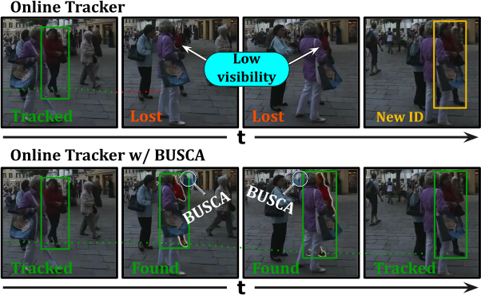
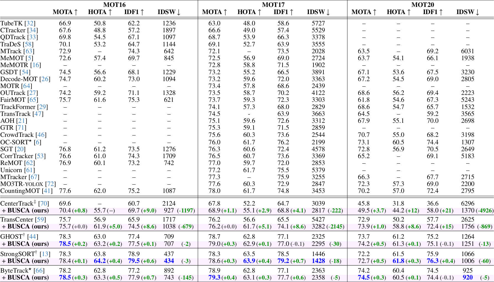

# 🔎 BUSCA for MOT

[](https://arxiv.org/abs/2407.10151) [](https://motchallenge.net/method/MOT=8608&chl=10) [](https://opensource.org/licenses/GPL-3.0) [](https://pytorch.org/)

This is the official repository of [**Lost and Found: Overcoming Detector Failures in Online Multi-Object Tracking**](https://arxiv.org/abs/2407.10151).

We propose **BUSCA** (**B**uilding **U**nmatched trajectorie**S** **C**apitalizing on **A**ttention), a compact plug-and-play module that can be integrated with *any* online Tracker by Detection (TbD) and enhance it.
BUSCA is fully-online and requires no retraining.

<div align="center">
  
</div>


## 📚 Abstract

Multi-object tracking (MOT) endeavors to precisely estimate the positions and identities of multiple objects over time. The prevailing approach, tracking-by-detection (TbD), first detects objects and then links detections, resulting in a simple yet effective method. However, contemporary detectors may occasionally miss some objects in certain frames, causing trackers to cease tracking prematurely. To tackle this issue, **we propose BUSCA**, meaning 'to search', **a versatile framework compatible with any online TbD system**, enhancing its ability **to persistently track those objects missed by the detector**, primarily due to occlusions. Remarkably, this is accomplished without modifying past tracking results or accessing future frames, i.e., **in a fully online manner**. BUSCA generates proposals based on neighboring tracks, motion, and learned tokens. Utilizing a decision Transformer that integrates multimodal visual and spatiotemporal information, it addresses the object-proposal association as a multi-choice question-answering task. **BUSCA is trained independently of the underlying tracker**, solely on synthetic data, without requiring fine-tuning. Through BUSCA, **we showcase consistent performance enhancements** across five different trackers **and establish a new state-of-the-art** baseline across three different benchmarks.


## 📈 vs. SOTA

<div align="center">
  
</div>


## 📥 Download BUSCA repository
You can download the BUSCA repository with the following command:
```bash
git clone https://github.com/lorenzovaquero/BUSCA.git
cd BUSCA
```


## 🌐 Download base trackers
The official code of BUSCA supports five different multi-object trackers ([StrongSORT](https://github.com/dyhBUPT/StrongSORT), [ByteTrack](https://github.com/ifzhang/ByteTrack), [GHOST](https://github.com/dvl-tum/GHOST), [TransCenter](https://gitlab.inria.fr/robotlearn/TransCenter_official), and [CenterTrack](https://github.com/xingyizhou/CenterTrack)), but its design allows it to be integrated into any online tracker by detection.
You can choose which one(s) you want to download with the following commands:
```bash
git submodule update --init trackers/StrongSORT/  # https://github.com/dyhBUPT/StrongSORT
git submodule update --init trackers/ByteTrack/  # https://github.com/ifzhang/ByteTrack
git submodule update --init trackers/GHOST/  # https://github.com/dvl-tum/GHOST
git submodule update --init trackers/TransCenter/  # https://gitlab.inria.fr/robotlearn/TransCenter_official
git submodule update --init trackers/CenterTrack/  # https://github.com/xingyizhou/CenterTrack
```


## 🛠️ Environment setup
BUSCA's dependencies can be found on [`requirements.txt`](requirements.txt). You can install them using **A)** a [Docker](https://www.docker.com/) container or **B)** directly through [pip](https://pypi.org/project/pip/).

  * ### A) Docker container
    The [`Dockerfile`](Dockerfile) we provide contains all the dependencies for BUSCA and the 5 supported baseline trackers.
    In order to build and run the container, we provide the scripts [`build.sh`](build.sh) and [`run_docker.sh`](run_docker.sh):
    ```bash
    ./build.sh  # Creates the image named "busca"
    ./run_docker.sh  # Instantiates a container named "busca_container"
    ```
    Keep in mind that, for building the Docker image, you will need GPU access during build (specifically, for TransCenter's MSDA and DCN).
    This can be achieved by using [`nvidia-container-runtime`](https://github.com/nvidia/nvidia-container-runtime#docker-engine-setup). You can find a short guide [here](https://stackoverflow.com/a/61737404) and some troubleshooting tips [here](https://stackoverflow.com/a/75629058).
    If none of this works, you can still proceed with the image creation and later manually install the [TransCenter dependencies](Dockerfile#L101-L105) at runtime, inside the container itself (you will be prompted with a warning when you start the container).

  * ### B) pip install
    The dependencies of BUSCA can be installed on the host machine with the following command (using a virtual environment like [venv](https://docs.python.org/3/library/venv.html) or [conda](https://conda.io/) is recommended):
    ```bash
    pip3 install -r requirements.txt -f https://download.pytorch.org/whl/cu115  # You may select your specific version of CUDA
    ```
    Keep in mind that, if you follow the pip approach, you will need to manually install the dependencies for the trackers you may want to use.


## 💾 Download BUSCA weights
The trainable components of BUSCA are the appearance feature extractor and the Decision Transformer. If you want to use our pretrained weights, you can find them on the following [Google Drive link](https://drive.google.com/drive/folders/1SvXexLRS0pbnZkxcSjQEEW3Sb6usiGw-).
You just need to download them and put `model_busca.pth` in the folder `models/BUSCA/motsynth/` and put `model_feats.pth` in the folder `models/feature_extractor/market1501/` (you may need to create the folder structure at the root of the repository). This can be done with the following command:
```bash
mkdir -p models/BUSCA/motsynth
gdown 15LB6SPHtDc-4_fLQtRIzU1YWOTF6vNf -O models/BUSCA/motsynth/model_busca.pth  # model_busca.pth

mkdir -p models/feature_extractor/market1501
gdown 1ZNU0yNkhMTlLRSOC0PR82SwK1ic9OJ8Y -O models/feature_extractor/market1501/model_feats.pth  # model_feats.pth
```


## 🗂️ Data preparation
You can download the data for [MOT17](https://motchallenge.net/data/MOT17/) and [MOT20](https://motchallenge.net/data/MOT20/) from the official website.
**Each tracker expects slightly different folder structures and data preprocessing** (please, check their respective repositories), but most of our scripts expect that the data will be organized as shown (you can edit the path to the datasets folder in [`run_docker.sh`](run_docker.sh#L3)):
```
/beegfs/datasets
├── MOT17
│   ├── test
│   └── train
└── MOT20
    ├── test
    └── train
```


## 🚀 Using BUSCA
In order to use BUSCA, you have to **1)** download the base tracker, **2)** setup the tracker and install its requirements, **3)** apply BUSCA to it, and **4)** run the experiment.
You can choose your favorite tracker, and in this example we will do it using [**StrongSORT**](https://github.com/dyhBUPT/StrongSORT).

### 1) Download base tracker
You can download StrongSORT from its [official repository](https://github.com/dyhBUPT/StrongSORT) using our `git submodule`.
```bash
git submodule update --init trackers/StrongSORT/  # https://github.com/dyhBUPT/StrongSORT
```

### 2) Setup base tracker
Each tracker has different setup processes and requirements. Please, check their official repositories for more detailed steps.
In the case of StrongSORT, you first need to install its [requirements](https://github.com/dyhBUPT/StrongSORT/blob/master/README.md#requirements) (this part is not necessary if you are using the Docker image we provide).
Secondly, you have to download its *prepared data* from [Google Drive](https://drive.google.com/drive/folders/1Zk6TaSJPbpnqbz1w4kfhkKFCEzQbjfp_?usp=sharing) or [Baidu Wangpan](https://pan.baidu.com/s/1EtBbo-12xhjsqW5x-dYX8A?pwd=sort) (code "`sort`"). You can do it with the following command:
```bash
mkdir -p trackers/StrongSORT/Dataspace
gdown 1I1Sk6a1i377UhXykqN9jZmbvJLc6izbz -O trackers/StrongSORT/Dataspace/MOT17_ECC_val.json  # MOT17_ECC_val.json
gdown 1zzzUROXYXt8NjxO1WUcwSzqD-nn7rPNr -O trackers/StrongSORT/Dataspace/MOT17_val_YOLOX+BoT --folder  # MOT17_val_YOLOX+BoT
```

### 3) Apply BUSCA
In order to apply BUSCA to a tracker, you simply have to copy and overwrite the files found in the [`adapters`](adapters/) folder. For our example, you can do it for StrongSORT as follows:
```bash
cp -TRv adapters/StrongSORT trackers/StrongSORT
```

### 4) Run experiment
You can run the experiments for the different trackers using the scripts found in the [`scripts`](scripts/) folder:
```bash
./scripts/run_strongsort.sh --dataset MOT17 --testset val
```
The results will be located in the `exp` folder. Once computed, the tracking metrics for **StrongSORT+BUSCA** on **MOT17-val** should be as follows:

| Model               |    MOTA↑    |    HOTA↑    |    IDF1↑    |   IDs↓   |
|---------------------|-------------|-------------|-------------|----------|
|StrongSORT           |   76.174    |   69.289    |   81.864    |   234    |
|**StrongSORT+BUSCA** | **76.795**  | **69.392**  | **82.272**  | **219**  |


## 🔢 Tracking metrics
You can measure the MOTA/HOTA/IDF1 metrics of the different trackers using the official code of [**TrackEval**](https://github.com/JonathonLuiten/TrackEval).


## 🦾 Training BUSCA
Coming soon! 🔜


## 🎬 Qualitative test set results
<div align="center">
  
  
</div>


## 📋 Notes

- You can apply BUSCA to other trackers! We would be very happy if you could report your new results!


## 🎓 Citation
If you find BUSCA useful, please star the project and consider citing us as:

```
@inproceedings{Vaquero2024BUSCA,
  author       = {Lorenzo Vaquero and
                  Yihong Xu and
                  Xavier Alameda-Pineda and
                  V{\'{\i}}ctor M. Brea and
                  Manuel Mucientes},
  title        = {Lost and Found: Overcoming Detector Failures in Online Multi-Object Tracking},
  booktitle    = {European Conf. Comput. Vis. ({ECCV})},
  pages        = {1--19},
  year         = {2024}
}
```
